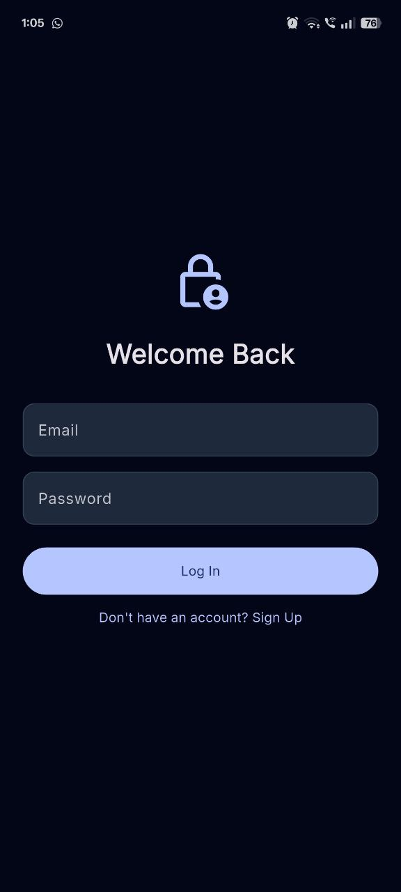
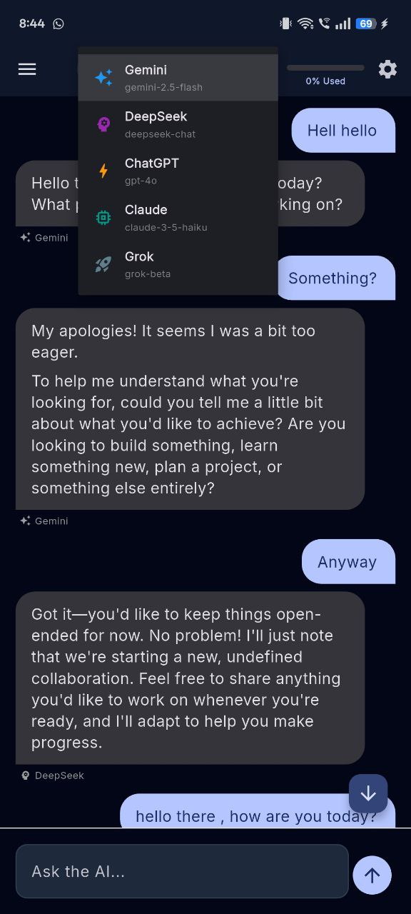
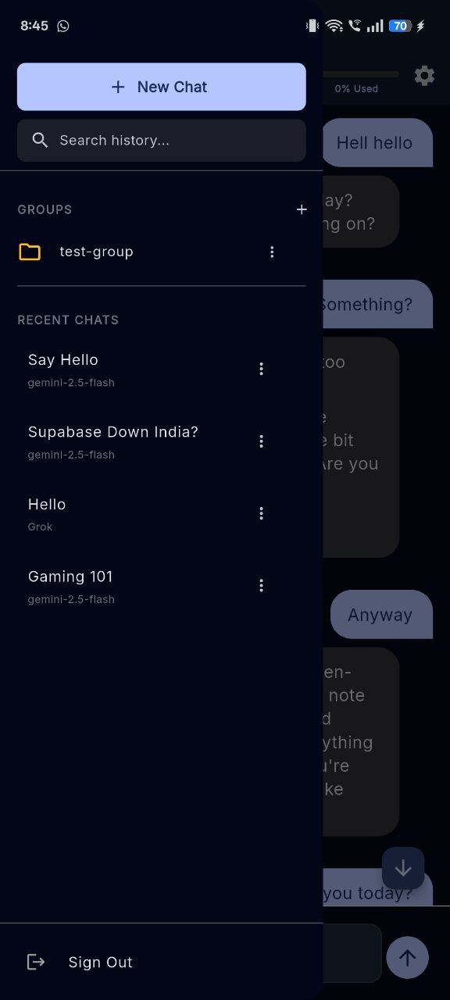
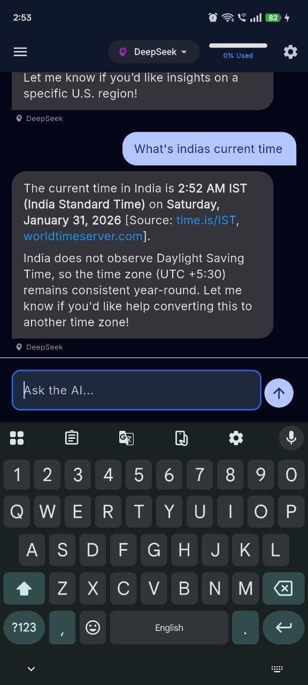
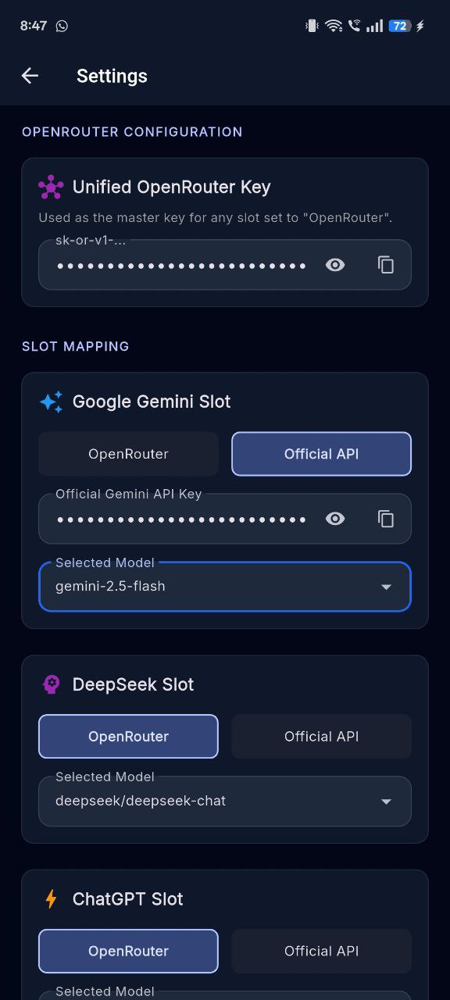

# **OneAI**

### Gemini, Claude, ChatGPT, DeepSeek, and Grok. All under one roof.

------------------------------------------------------------------------

## 🚀 Overview

**OneAI** is a high-performance, developer-first AI workspace that
consolidates the world's leading Large Language Models into a single,
unified interface --- without SaaS restrictions, rate caps, or platform
lock-in.

It is designed as a personal power tool for engineers who want:

-   Direct API-level control
-   Intelligent multi-model routing
-   Real-time web-grounded responses
-   Strict cost governance
-   Zero commercial abstraction layers

This project demonstrates system design across AI orchestration, RAG
pipelines, secure key handling, and vector search infrastructure.

------------------------------------------------------------------------

## 📸 App Screenshots

------------------------------------------------------------------------

## 🧠 Core Capabilities

### 🔹 Universal Multi-Model Access

Supports:

-   Gemini (2.5 Flash, 3 Pro)
-   GPT‑4o
-   Claude 3.5 (Sonnet / Haiku)
-   DeepSeek (V3, R1)
-   Grok (2, Beta)

**Slot-Based Architecture** - Map OpenRouter master keys or official
provider SDK keys - Dynamically assign models per slot - Swap providers
without backend reconfiguration

------------------------------------------------------------------------

### 🔀 Intelligent Routing Engine

The `AIFactory` layer:

-   Detects OpenRouter vs Official API keys
-   Normalizes model identifiers
-   Dynamically formats headers
-   Prevents routing mismatch failures

Result: consistent model invocation regardless of frontend request
format.

------------------------------------------------------------------------

### 🎨 Interactive AI Artifacts

OneAI goes beyond standard chat interfaces by supporting **Artifacts**—dedicated, stateful workspaces for code, documents, and structured data.
-   **Stateful Execution:** The backend continuously tracks the `current_artifact` state within the database for each specific chat session.
-   **Iterative Refinement:** Models can read the existing artifact state and iteratively update, patch, or rewrite code blocks without losing context.
-   **Cross-Model Handoff:** Because artifact state is persisted at the database level per chat, you can generate a codebase with DeepSeek, seamlessly switch to Claude 3.5 Sonnet, and ask it to refactor the exact same artifact.

------------------------------------------------------------------------

## 🌐 Autonomous Web RAG Pipeline

When temporal or real-time intent is detected, OneAI activates a custom
Retrieval-Augmented Generation workflow:

1.  **Search** -- DuckDuckGo HTML query (non-sponsored results)
2.  **Scrape** -- Extract clean article content via Cheerio
3.  **Chunk** -- RecursiveCharacterTextSplitter (LangChain)
4.  **Embed** -- Vector embeddings generated per chunk
5.  **Store** -- Supabase pgvector
6.  **Retrieve** -- Cosine similarity top‑k match
7.  **Inject** -- Context + source URLs prepended to prompt

This ensures responses are grounded in current, external information
instead of static training data.

------------------------------------------------------------------------

## 💰 Cost Safety System

-   Real-time token tracking
-   Model-specific daily budget ceilings
-   Loop and runaway prevention
-   No artificial SaaS paywalls --- just enforced safety thresholds

Demonstrates practical API governance design.

------------------------------------------------------------------------

## 🛠️ Tech Stack

### Frontend

-   Flutter (Dart)
-   Riverpod
-   Shared Preferences
-   Material 3 (Adaptive theming)

### Backend

-   Node.js
-   TypeScript
-   Express
-   Cheerio
-   LangChain
-   Supabase (PostgreSQL + pgvector)

------------------------------------------------------------------------

## 🏗️ Architecture Focus

This project highlights:

-   Stateless API design with secure header key injection
-   Vector similarity search with pgvector
-   Custom RAG pipeline implementation
-   Dynamic multi-provider orchestration
-   Budget-aware AI execution model
-   Clean separation between client key storage and backend execution

------------------------------------------------------------------------

## 🔐 Security Model

-   API keys stored locally on-device
-   Backend never persists credentials
-   Stateless execution model
-   No multi-tenant storage layer
-   No remote key logging

Designed intentionally as a private AI control workspace.

------------------------------------------------------------------------

## ⚠️ Deployment Philosophy

OneAI is intentionally **not** a public SaaS product.

It is built as:

-   A personal AI engineering lab
-   A project to learn system design
-   A daily-driver AI orchestration workspace

The absence of authentication layers and RLS is deliberate to maintain
simplicity and control for single-user execution.

------------------------------------------------------------------------

## 📌 Why This Project Matters

This repository demonstrates practical application of:

-   AI orchestration patterns
-   Retrieval-Augmented Generation systems
-   API cost governance
-   Secure key architecture
-   Cross-platform frontend engineering
-   Vector database integration

It is not just an AI wrapper --- it is an infrastructure-level AI
control system.

------------------------------------------------------------------------

## 📄 License

Fun personal project. Not intended for commercial redistribution.